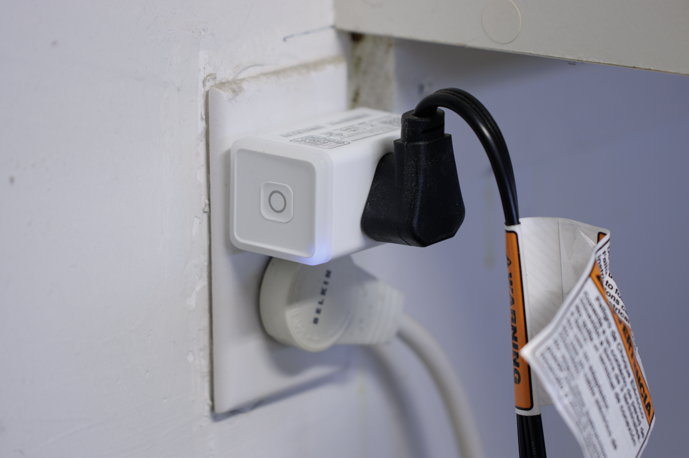

 LaundryDuty
===

[](https://github.com/Aldaviva/LaundryDuty/actions/workflows/dotnet.yml) [![Testspace](https://img.shields.io/testspace/tests/Aldaviva/Aldaviva:LaundryDuty/master?passed_label=passing&failed_label=failing&logo=data%3Aimage%2Fsvg%2Bxml%3Bbase64%2CPHN2ZyB4bWxucz0iaHR0cDovL3d3dy53My5vcmcvMjAwMC9zdmciIHZpZXdCb3g9IjAgMCA4NTkgODYxIj48cGF0aCBkPSJtNTk4IDUxMy05NCA5NCAyOCAyNyA5NC05NC0yOC0yN3pNMzA2IDIyNmwtOTQgOTQgMjggMjggOTQtOTQtMjgtMjh6bS00NiAyODctMjcgMjcgOTQgOTQgMjctMjctOTQtOTR6bTI5My0yODctMjcgMjggOTQgOTQgMjctMjgtOTQtOTR6TTQzMiA4NjFjNDEuMzMgMCA3Ni44My0xNC42NyAxMDYuNS00NFM1ODMgNzUyIDU4MyA3MTBjMC00MS4zMy0xNC44My03Ni44My00NC41LTEwNi41UzQ3My4zMyA1NTkgNDMyIDU1OWMtNDIgMC03Ny42NyAxNC44My0xMDcgNDQuNXMtNDQgNjUuMTctNDQgMTA2LjVjMCA0MiAxNC42NyA3Ny42NyA0NCAxMDdzNjUgNDQgMTA3IDQ0em0wLTU1OWM0MS4zMyAwIDc2LjgzLTE0LjgzIDEwNi41LTQ0LjVTNTgzIDE5Mi4zMyA1ODMgMTUxYzAtNDItMTQuODMtNzcuNjctNDQuNS0xMDdTNDczLjMzIDAgNDMyIDBjLTQyIDAtNzcuNjcgMTQuNjctMTA3IDQ0cy00NCA2NS00NCAxMDdjMCA0MS4zMyAxNC42NyA3Ni44MyA0NCAxMDYuNVMzOTAgMzAyIDQzMiAzMDJ6bTI3NiAyODJjNDIgMCA3Ny42Ny0xNC44MyAxMDctNDQuNXM0NC02NS4xNyA0NC0xMDYuNWMwLTQyLTE0LjY3LTc3LjY3LTQ0LTEwN3MtNjUtNDQtMTA3LTQ0Yy00MS4zMyAwLTc2LjY3IDE0LjY3LTEwNiA0NHMtNDQgNjUtNDQgMTA3YzAgNDEuMzMgMTQuNjcgNzYuODMgNDQgMTA2LjVTNjY2LjY3IDU4NCA3MDggNTg0em0tNTU3IDBjNDIgMCA3Ny42Ny0xNC44MyAxMDctNDQuNXM0NC02NS4xNyA0NC0xMDYuNWMwLTQyLTE0LjY3LTc3LjY3LTQ0LTEwN3MtNjUtNDQtMTA3LTQ0Yy00MS4zMyAwLTc2LjgzIDE0LjY3LTEwNi41IDQ0UzAgMzkxIDAgNDMzYzAgNDEuMzMgMTQuODMgNzYuODMgNDQuNSAxMDYuNVMxMDkuNjcgNTg0IDE1MSA1ODR6IiBmaWxsPSIjZmZmIi8%2BPC9zdmc%2B)](https://aldaviva.testspace.com/spaces/196572) [](https://coveralls.io/github/Aldaviva/LaundryDuty?branch=master)

*Notify you when your washing machine has finished a load of laundry by sending a PagerDuty alert.*

<!-- MarkdownTOC autolink="true" bracket="round" autoanchor="true" levels="1,2,3" bullets="1.,-,-,-" -->

1. [Prerequisites](#prerequisites)
1. [Installation](#installation)
1. [Configuration](#configuration)
    - [Power levels](#power-levels)
1. [Running](#running)
1. [Alerts](#alerts)

<!-- /MarkdownTOC -->

<a id="prerequisites"></a>
## Prerequisites
- [.NET 6 x64 Runtime](https://dotnet.microsoft.com/en-us/download/dotnet) or later
- Windows 10 or Windows Server 2016, or later
- [Kasa smart outlet](https://www.kasasmart.com/us/products/smart-plugs) with energy monitoring
    - Tested with [KP125](https://www.kasasmart.com/us/products/smart-plugs/kasa-smart-plug-slim-energy-monitoring-kp125)
    - Probably works with [EP25](https://www.kasasmart.com/us/products/smart-plugs/kasa-smart-plug-slim-energy-monitoring-ep25) and [KP115](https://www.kasasmart.com/us/products/smart-plugs/kasa-smart-plug-slim-energy-monitoring-kp115) as well
- [PagerDuty account](https://www.pagerduty.com/sign-up/) (the [free plan](https://www.pagerduty.com/sign-up-free/?type=free) is sufficient)

<a id="installation"></a>
## Installation
1. Download the [latest release](https://github.com/Aldaviva/LaundryDuty/releases/latest) [ZIP file](https://github.com/Aldaviva/LaundryDuty/releases/latest/download/LaundryDuty.zip).
1. Extract the ZIP file to a folder, such as `C:\Program Files\LaundryDuty\`.
1. Run the `.\Install service.ps1` script file in an elevated PowerShell window.
    - If PowerShell throws an `ExecutionPolicy` error, you will need to run
        ```ps1
        Set-ExecutionPolicy RemoteSigned -Scope Process -Force
        & '.\Install service.ps1'
        ```

<a id="configuration"></a>
## Configuration
1. Plug your washing machine's power cord into your Kasa smart outlet.
1. Plug the smart outlet into a NEMA 5-15-R 120VAC wall outlet.
    <p align="center"></p>
1. Connect the smart outlet to your Wi-Fi network using the Kasa Android or iOS app.
1. Get the smart outlet's **IP address** from your router's client or DHCP list, or by running `nmap --open -pT:9999 192.168.0.0/16`.
    - You may optionally assign an A record to this IP address in DNS, and use it instead of the IP address.
1. Create an Integration in PagerDuty and get its Integration Key.
    1. Sign into your [PagerDuty account](https://app.pagerduty.com/).
    1. Go to Services › Service Directory.
    1. Select an existing Service for which you want to publish events, or create a new Service.
    1. In the Integrations tab of the Service, add a new Integration.
    1. Under Most popular integrations, select Events API V2, then click Add.
    1. Expand the newly-created Integration and copy its **Integration Key**, which will be used to authorize this program to send Events to the correct Service.
1. Edit the `appsettings.json` configuration file.
    |Key|Example|Description|
    |-|-|-|
    |`minimumActiveMilliwatts`|`750`|If the outlet is drawing at least this many milliwatts, then the washing machine will be considered to be currently washing a load of laundry. See [power levels](#power-levels).|
    |`maximumIdleMilliwatts`|`413`|If the outlet is drawing at most this many milliwatts, then the washing machine will be considered to have completed its most recent load of laundry and had its lid opened. Readings of 0 mW are ignored. See [power levels](#power-levels).|
    |`pollingIntervalMilliseconds`|`15000`|How often to check the power usage of the washing machine, in milliseconds.|
    |`pagerDutyIntegrationKey`|`"y5mfpn493se259tq8s6rg4yswndvj38w"`|The PagerDuty Events API V2 Integration Key that you created in the previous step.|
    |`outletHostname`|`"192.168.1.100"`|The FQDN or IP address of the Kasa smart outlet that is powering the washing machine.|
    |`outletTimeoutMilliseconds`|`2000`|How long, in milliseconds, to wait to connect to the outlet or receive a response before either retrying or giving up until the next iteration of the polling loop.|
    |`outletMaxAttempts`|`10`|How many times to attempt to connect to the outlet in one iteration of the polling loop if the previous attempts failed before giving up and trying again in the next iteration.|
    |`outletRetryDelayMilliseconds`|`1000`|How long to wait, in milliseconds, between repeated attempts to connect to the outlet in one iteration of the polling loop if the previous attempts failed.|
    |`outletOfflineDurationBeforeIncidentMilliseconds`|`900000`|How long, in milliseconds, the outlet can be unreachable before a PagerDuty incident is triggered to tell you it's offline. Defaults to `0`, which means never trigger an outlet offline incident.|
    |`Logging.LogLevel.Default`|`"Information"`|Minimum severity of log events to emit. Values are `Trace`, `Debug`, `Information`, `Warning`, `Error`, `Critical`, and `None`.<br>View logs in Event Viewer.|

<a id="power-levels"></a>
### Power levels
This program relies on detecting the running state of a washing machine by observing its instantaneous wattage being consumed, as exposed by the smart outlet's energy monitoring. The wattage levels of each state require precise fine-tuning and will vary between washing machine models.

The example values given are for a Kenmore 500 Series washing machine. They were derived by [writing a program](https://github.com/Aldaviva/LaundryDuty/wiki/Outlet-power-logging) using [Aldaviva/Kasa](https://github.com/Aldaviva/Kasa) to periodically log the current, voltage, and power of the washing machine when it was in each state (**active**, **complete**, and **idle**) to find a pattern in the energy usage. After some spreadsheets and histograms, the following state machine was derived.

<p>
<figure>
    
    <figcaption><div align="center"><em>Washing machine state machine. All values are power in milliwatts.</em></div></figcaption>
</figure>
</p>

A complication is that the transition from complete to idle when the power drops below 413 mW is not symmetric &mdash; the state cannot then change directly from idle to complete without first becoming active again. This is to prevent spurious high power readings when the machine is idle from incorrectly putting it back in the complete state.

<a id="running"></a>
## Running

Do any of the following.
- Start the `LaundryDuty` service from Services (`services.msc`)
- `net start LaundryDuty`
- `sc start LaundryDuty`
- `Start-Service LaundryDuty`

<a id="alerts"></a>
## Alerts

1. When the washing machine becomes active, this program will send a Change event to PagerDuty with the summary
    ```text
    The washing machine is starting a load of laundry.
    ```
    
    <p align="center"></p>

1. When the washing machine completes the load, this program will trigger a new Alert at the Info severity, with the summary
    ```text
    The washing machine has finished a load of laundry.
    ```
    
    <p align="center"></p>

1. When the washing machine's lid is opened after it finishes a load, this program will automatically resolve the previously-created Alert. You can also manually resolve the alert from the PagerDuty web or mobile apps.
    <p align="center"></p>
